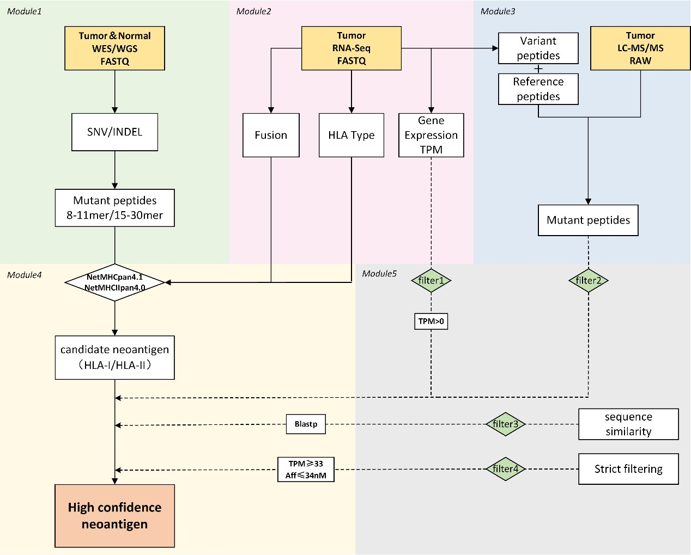

# ProGeo-neo v2.0

A One-stop software for Neoantigen Prediction and Filtering based on the Proteogenomics strategy.
## Neoantigen Prediction and Filtering Pipeline

## Introduction
ProGeo-neo v2.0 is a one-stop software solution for predicting neoantigens from the paired tumour-normal WGS/WES data in FASTQ format. ProGeo-neo v2.0 provides new features such as in-frame indels, frameshift mutations, and gene fusion analysis. In addition, the new version supports the prediction of MHC class II-restricted neoantigens, i.e. peptides up to 30mer in length. The source of neoantigens has been expanded, allowing more candidate neoantigens to be identified for follow-up studies. In addition, we propose two more efficient screening approaches, mainly using an in-group authentic neoantigen database for neoantigen screening. The range of candidate peptides was effectively narrowed down to those that are more likely to elicit an immune response, providing a more meaningful reference for subsequent experimental validation. Compared to ProGeo-neo, the ProGeo-neo v2.0 performs well on the same data set, and this means that our upgrades are necessary, both in updated functionality and improved accuracy. 
